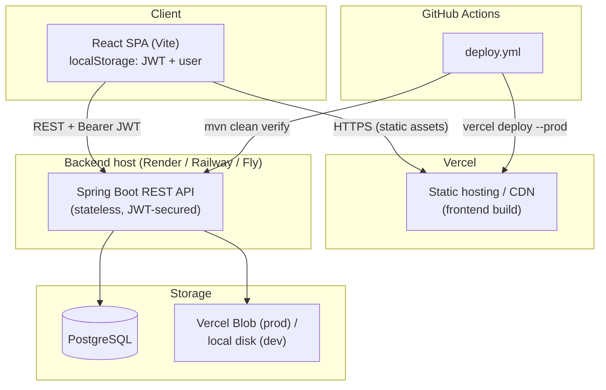
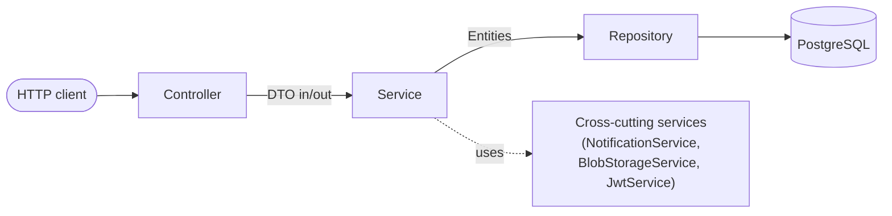
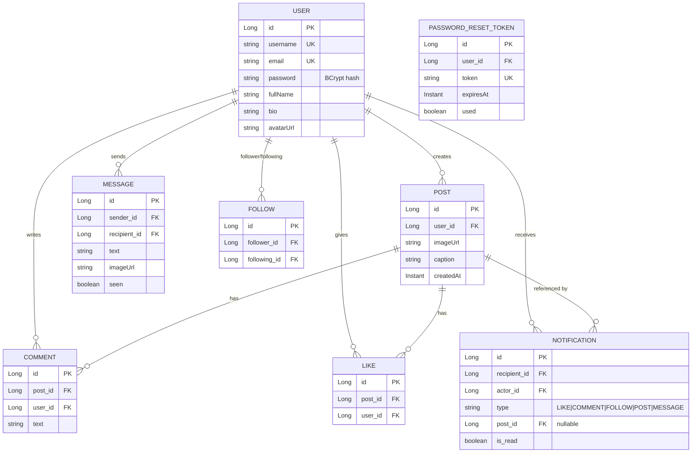
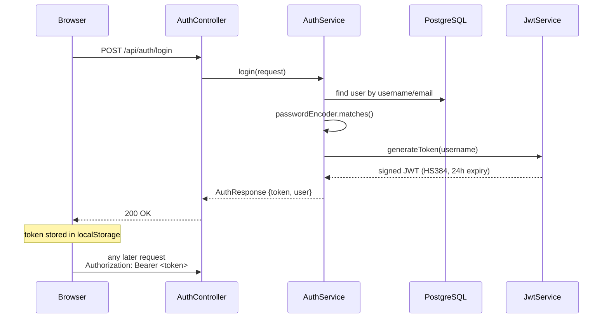
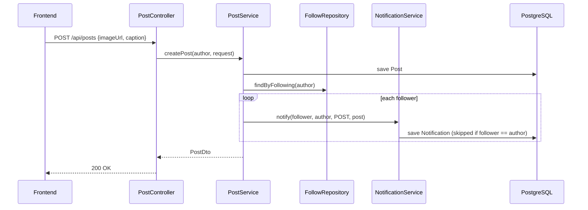
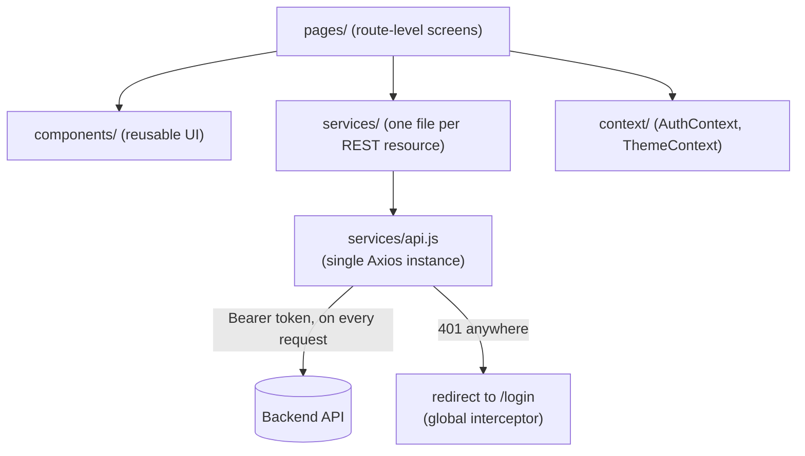
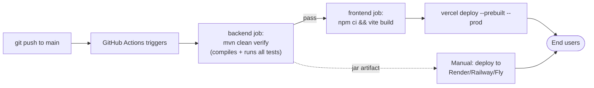

# Snapgram — Architecture & Design Document

This document describes the system architecture of Snapgram (the Instagram-clone in
this repo), the reasoning behind key decisions, and — most importantly — how the
architecture is meant to absorb new features without requiring a rewrite. Diagrams are
Mermaid (renders natively on GitHub); code snippets are excerpts from the actual
codebase, not pseudocode.

## 1. System overview

Snapgram is a full-stack social media application: JWT-authenticated users can post
photos, like/comment/follow/message each other, and receive notifications. The system
is split into two independently deployable halves, connected only over HTTP:

- **Frontend**: React 18 SPA (Vite), talks to the backend exclusively via a REST API.
- **Backend**: Spring Boot 3 REST API, stateless (no server-side sessions), backed by
  PostgreSQL and pluggable image storage.



**Why split this way?** Vercel does not execute long-running JVM processes — it only
hosts static assets and short-lived serverless functions. Rather than force the backend
into a shape Vercel doesn't support, the frontend and backend are deployed
independently and communicate purely over HTTP. This is also what makes the two sides
independently *scalable*: you can add backend replicas, swap the database, or change
hosts without touching the frontend deploy, and vice versa.

## 2. Backend architecture: strict layering

Every feature in the backend follows the same four-layer shape. This is the single
biggest reason new features are cheap to add — you always know exactly where a piece
of logic belongs.



| Layer | Responsibility | Never does |
|---|---|---|
| **Controller** (`controller/`) | HTTP mapping, pulls the authenticated `User` via `Authentication`, delegates to a service, returns a DTO | Business logic, direct repository access |
| **Service** (`service/`) | Business rules, transactions, orchestration between repositories and other services | Know about HTTP (`ResponseEntity`, status codes) |
| **Repository** (`repository/`) | Spring Data JPA interfaces — data access only | Business logic |
| **DTO** (`dto/`) | The API's actual contract — decoupled from JPA entities on purpose | Map 1:1 to database columns (they don't have to) |

Every entity that's user-facing (`User`, `Post`, `Comment`, `Like`, `Follow`,
`Message`, `Notification`) has its own file in each of these four folders, named
consistently (`Post.java` / `PostRepository.java` / `PostService.java` /
`PostController.java` / `PostDto.java`). **Adding a new feature means adding a new set
of these five files that follow the existing pattern — not modifying existing ones.**

## 3. Data model



**Design choices worth calling out:**

- `LIKE` and `FOLLOW` are join-entities with their own identity (not raw many-to-many
  join tables), because both needed a `createdAt` and, for `Like`, needed to be queried
  independently (`existsByPostAndUser`, `countByPost`). This is what let likes and
  follows each get their own repository, and it's the same shape a future "bookmark" or
  "block" feature would take.
- `Notification.post` is nullable — not every notification type (`FOLLOW`, `MESSAGE`)
  has an associated post. This one nullable column is why a single `Notification`
  entity can represent five different notification types instead of five tables.

## 4. Authentication & security

JWT is stateless and carries only the username as its subject — no server-side session
store, which is what makes the backend horizontally scalable (any replica can validate
any token; nothing needs to be sticky or shared).



Every request after login goes through one filter that validates the token and
populates Spring Security's context — this is the *only* place JWT validation logic
lives:

```java
// JwtAuthenticationFilter.java
if (jwtService.isTokenValid(token) && SecurityContextHolder.getContext().getAuthentication() == null) {
    try {
        String username = jwtService.extractUsername(token);
        UserDetails userDetails = userDetailsService.loadUserByUsername(username);
        UsernamePasswordAuthenticationToken authToken = new UsernamePasswordAuthenticationToken(
                userDetails, null, userDetails.getAuthorities());
        SecurityContextHolder.getContext().setAuthentication(authToken);
    } catch (Exception ignored) {
        // stale token subject (e.g. deleted user) -> request proceeds unauthenticated
    }
}
```

Authorization rules are centralized in one place, not scattered across controllers:

```java
// SecurityConfig.java
.authorizeHttpRequests(auth -> auth
        .requestMatchers("/api/auth/**", "/api/health", "/uploads/**").permitAll()
        .anyRequest().fullyAuthenticated()
)
```

Adding a new permission tier later (e.g., an admin-only moderation endpoint) is a
one-line addition here (`.requestMatchers("/api/admin/**").hasRole("ADMIN")`) — it does
not require touching every controller.

## 5. Cross-cutting services — the extensibility pattern in practice

Three services are deliberately generic so that *every* feature can reuse them instead
of reinventing the same logic:

### 5.1 NotificationService — one method, five notification types

```java
// NotificationService.java
@Transactional
public void notify(User recipient, User actor, NotificationType type, Post post) {
    if (recipient.getId().equals(actor.getId())) {
        return; // never notify people about their own actions
    }
    Notification notification = Notification.builder()
            .recipient(recipient).actor(actor).type(type).post(post)
            .build();
    notificationRepository.save(notification);
}
```

Every feature that needs to notify someone calls this one method — it's a single line
in the calling service:

```java
// LikeService.java
notificationService.notify(post.getUser(), currentUser, NotificationType.LIKE, post);

// FollowService.java
notificationService.notify(target, currentUser, NotificationType.FOLLOW, null);

// PostService.java — fan-out to every follower on a new post
followRepository.findByFollowing(author)
        .forEach(f -> notificationService.notify(f.getFollower(), author, NotificationType.POST, savedPost));
```

**Adding a new notification-worthy event (e.g., "someone shared your post") is a
one-line call, an added enum constant, and a frontend label — nothing about
`NotificationService` itself changes.**

### 5.2 BlobStorageService — storage backend is swappable behind one method

```java
public String upload(MultipartFile file, String folder) {
    if (readWriteToken == null || readWriteToken.isBlank()) {
        return uploadToLocalDisk(file, folder, filename);   // local dev
    }
    return uploadToVercelBlob(file, folder, filename);      // production
}
```

Every caller (post images, avatars, message attachments) only ever calls
`upload(file, folder)`. Swapping Vercel Blob for S3/Cloudinary later means changing the
inside of this one class — zero changes to `PostController`, `UserController`, or
`MessageController`.

### 5.3 UserService.toDto — one mapping function, every response shape

Every endpoint that returns user data (profile, search, comment author, message
sender, notification actor, follower/following lists) goes through the same
`UserService.toDto(User, User currentUser)` — so "is this profile followed by the
current viewer" logic exists in exactly one place, not duplicated per endpoint.

## 6. Key request flow: creating a post (fan-out on write)



This is a deliberate **fan-out-on-write** design: notifications are generated once, at
post time, rather than computed on every feed read. At this app's scale (a handful of
users, low follower counts) this is trivially fast. The scalability section below
covers what changes if follower counts grow into the thousands.

## 7. Frontend architecture



- **One Axios instance** (`services/api.js`) attaches the JWT to every outgoing request
  and centrally handles `401` (redirects to login) — no page manages auth headers
  itself.
- **One service module per REST resource** (`postService.js`, `messageService.js`,
  `notificationService.js`, ...) — a page never calls `axios` directly, it calls a
  named function (`postService.getFeed()`), which keeps the HTTP contract in one place
  per resource, mirroring the backend's per-entity file layout.
- **Adding a new page** = one new file in `pages/`, one new service module (if it talks
  to a new endpoint), one route in `App.jsx`, and (optionally) a nav link — the existing
  pages/routes are untouched.

## 8. CI/CD pipeline



The backend job runs on every push *and* every PR (so a broken build is caught before
merge); the frontend deploy job only runs on `main` and only after the backend job
passes, so a broken backend can never get a green frontend deploy layered on top of it.

## 9. Scalability & extensibility roadmap

The architecture above was chosen specifically so each of the following upgrades is
additive — a new component bolted on — rather than a rewrite of existing code.

| Concern | Current approach | Scale-up path | What has to change |
|---|---|---|---|
| **Compute** | Single Spring Boot instance | Run N replicas behind a load balancer | Nothing — auth is stateless JWT, there is no in-memory session state to make sticky |
| **Real-time updates** | Client-side polling (4s for messages, 10s for notification count) | WebSocket (Spring STOMP) or SSE push | Only the transport in `Conversation.jsx`/`Navbar.jsx`; the DTOs and backend service methods stay identical |
| **Read load** | Single PostgreSQL instance | Add a read replica; route `GET`-heavy endpoints (explore/feed/search) to it | A `@Transactional(readOnly = true)` + routing datasource — repositories/services unchanged |
| **Feed fan-out** | Fan-out-on-write per post (loop over followers) | For "celebrity" accounts with huge follower counts, switch to fan-out-on-read (compute feed at query time) for just those accounts | Isolated to `PostService.createPost` / `getHomeFeed`; `NotificationService.notify` signature doesn't change |
| **Hot data** | Every request hits PostgreSQL | Redis cache for unread notification counts, explore feed page 1 | Additive cache-aside in `NotificationService`/`PostService`; controllers untouched |
| **Media storage** | Local disk (dev) / Vercel Blob (prod) via `BlobStorageService` | Swap to S3 + CloudFront, or add image resizing on upload | Confined entirely to `BlobStorageService`; zero caller changes |
| **New social features** (stories, reels, bookmarks, groups) | N/A yet | Add `Model` + `Repository` + `Service` + `Controller` + `Dto`, reuse `NotificationService.notify()` for alerts | New files only, following the existing per-entity pattern |
| **Rate limiting / abuse prevention** | None yet | Add a filter (e.g., Bucket4j) in the same filter chain position as `JwtAuthenticationFilter` | One new filter bean; no controller changes |
| **Authorization tiers** (e.g. admin/moderator) | Two tiers: public auth endpoints vs. fully-authenticated everything else | Add `.requestMatchers("/api/admin/**").hasRole("ADMIN")` in `SecurityConfig` + a `role` column on `User` | One config line + one migration; `JwtAuthenticationFilter` unchanged |
| **Service decomposition** (only if truly needed) | Monolith; Messaging and Notifications already only reference other entities by ID, not by object graph traversal | Extract Messaging and/or Notifications into separate deployable services communicating over an event bus (e.g. on a `PostCreated` event) | Possible *because* those two modules were kept loosely coupled from day one |

## 10. Environment & configuration

All environment-specific values are externalized (never hardcoded), which is what
makes the same codebase run in local dev, CI, and production without modification:

| Variable | Local default | Production |
|---|---|---|
| `DB_URL` / `DB_USERNAME` / `DB_PASSWORD` | local PostgreSQL | Render's managed PostgreSQL (free tier) |
| `JWT_SECRET` | insecure placeholder | long random secret |
| `BLOB_READ_WRITE_TOKEN` | unset → local disk fallback | Vercel Blob token |
| `CORS_ALLOWED_ORIGINS` | `http://localhost:5173` | deployed Vercel URL |
| `VITE_API_BASE_URL` (frontend) | `http://localhost:8080` | deployed backend URL |

See `README.md` for the full list and setup instructions.

## 11. Summary

The core architectural bet in this project is: **keep every feature in its own
vertical slice (Model → Repository → Service → Controller → DTO), and put anything
shared behind a small number of generic, single-purpose services**
(`NotificationService`, `BlobStorageService`, `UserService.toDto`). That combination is
why the scaling paths in §9 are additive rather than invasive — the codebase was built
assuming it would grow.
